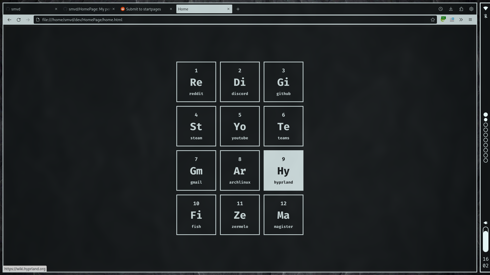

# HomePage

This is my personal homepage and the generator for it.
It's styled after a monochrome periodic table and has some simple fade-in animations.

## Generating the home page

To generate the home page you will first need to edit the `content.csv` file.
`content.csv` is a plain CSV file where each line corresponds to a cell in the periodic table.

Each line has three values:
* name
* URL
* category

All the URLs will be prepended with `https://` before being inserted into the template.
You can also use a blank entry with the name of `blank`, this will create a invisible chunk to act as spacing.
Leave the category value empty for default white color.

If you would like for your categories to have different colors then you can edit `categories.csv`
where the first value is the name of the category and the second the hex color.

After you edit `content.csv` and `categories.csv` you just need to run the python script which will generate `home.html`.
Then you can just set the `home.html` file as your home page and you're good to go.
